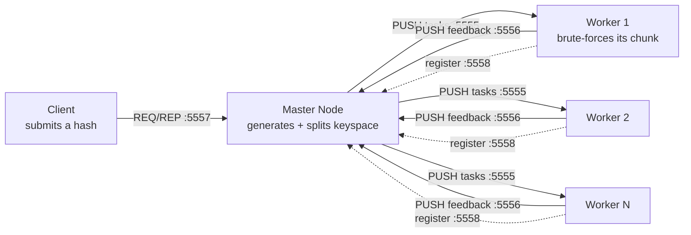

# Distributed Password Cracker

A distributed MD5 hash brute-forcer built in Python with **ZeroMQ**. A master node splits the search keyspace across any number of worker nodes running on separate machines, collects their results, and signals every worker to stop the moment one of them finds the password.

> **Purpose and scope.** This is an educational project built to understand *why* fast, unsalted hashes like MD5 are unsuitable for storing passwords, and to learn how a brute-force workload can be distributed across machines. It cracks short lowercase strings against hashes I generate myself. It is not built for, and should not be used against, any hash you are not authorised to test.

---

## Why I Built It

Two things I wanted to understand properly rather than just read about:

1. **Why MD5 is a broken choice for passwords.** The best way to feel this is to watch how fast a small cluster chews through the keyspace. A hashing algorithm being *fast* is exactly what makes it *weak* for password storage — the opposite of what a good scheme (bcrypt, Argon2) is designed for.
2. **How you actually distribute a workload.** Splitting a search space across workers, coordinating them over the network, collecting results, and shutting the whole thing down cleanly is a real distributed-systems problem, not just a loop.

---

## Architecture

Three components communicate over four ZeroMQ sockets.



| Component | File | Role |
| --------- | ---- | ---- |
| **Client** | `client.py` | Prompts for an MD5 hash and sends it to the master, then waits for the result |
| **Master** | `master_node.py` | Registers workers, generates the full keyspace, divides it into equal chunks, distributes them, and relays the answer back to the client |
| **Worker** | `workernode.py` | Registers with the master, receives a chunk, hashes each candidate, and reports success or failure |

### Socket design

| Port | Pattern | Purpose |
| ---- | ------- | ------- |
| 5557 | REQ / REP | Client submits a hash, master replies with the result |
| 5558 | PUSH / PULL | Workers register their readiness with the master |
| 5555 | PUSH / PULL | Master pushes work chunks out to workers |
| 5556 | PUSH / PULL | Workers push results back to the master |

The PUSH/PULL pattern on port 5555 gives load-balanced, fan-out task distribution for free — ZeroMQ round-robins chunks to connected workers without the master tracking each one individually.

---

## How It Works

1. The **client** submits an MD5 hash to the master over REQ/REP.
2. The **master** waits briefly for workers to register, then generates every lowercase string up to length 5 and divides that keyspace into one contiguous chunk per worker.
3. Each **worker** receives its chunk, MD5-hashes every candidate, and compares against the target.
4. On a match, the worker pushes the plaintext back; the master relays it to the client and broadcasts a termination signal so no worker keeps grinding a dead search.

---

## Running It

Requires Python 3 and `pyzmq` (`pip install pyzmq`).

Set `SERVER_IP` in `client.py` and `workernode.py` to the master's address, then:

```bash
# On the master machine
python master_node.py

# On each worker machine (or several terminals on one host)
python workernode.py

# On the client
python client.py
# then paste an MD5 hash of a lowercase string up to 5 characters
```

Generate a test hash to crack:

```bash
python -c "import hashlib; print(hashlib.md5('hello'.encode()).hexdigest())"
```

---

## Known Limitations & What I'd Improve

I'm listing these deliberately — knowing where a tool falls short is part of building it.

- **Fixed keyspace.** Lowercase a–z, max length 5, hard-coded. A real tool would take charset and length as parameters.
- **MD5 only.** Extending to SHA-1/SHA-256, or to salted hashes, would show why salting defeats exactly this approach.
- **Static work division.** The keyspace is split once at the start, so a worker that finishes early sits idle. A work-queue model where workers pull the next chunk on demand would balance better.
- **No fault tolerance.** If a worker dies mid-chunk, that part of the keyspace is never searched. Re-queuing lost chunks would fix it.
- **Dictionary and rule-based attacks** would be far more realistic than pure brute force, and are the natural next step.

---

## What I Took Away

- Fast hashing and password security are in direct tension — the speed that makes this cracker work is precisely the property a password hash must *not* have.
- Coordinating processes over a network is mostly about the boring parts: registration, clean shutdown, and what happens when something doesn't respond.
- ZeroMQ's socket patterns do a lot of heavy lifting; choosing the right one per channel (REQ/REP vs PUSH/PULL) shaped the whole design.

---

## Contact

**Yousef Alturki** — [LinkedIn](https://www.linkedin.com/in/reachyousefalturki) · reachyousefalturki@gmail.com
